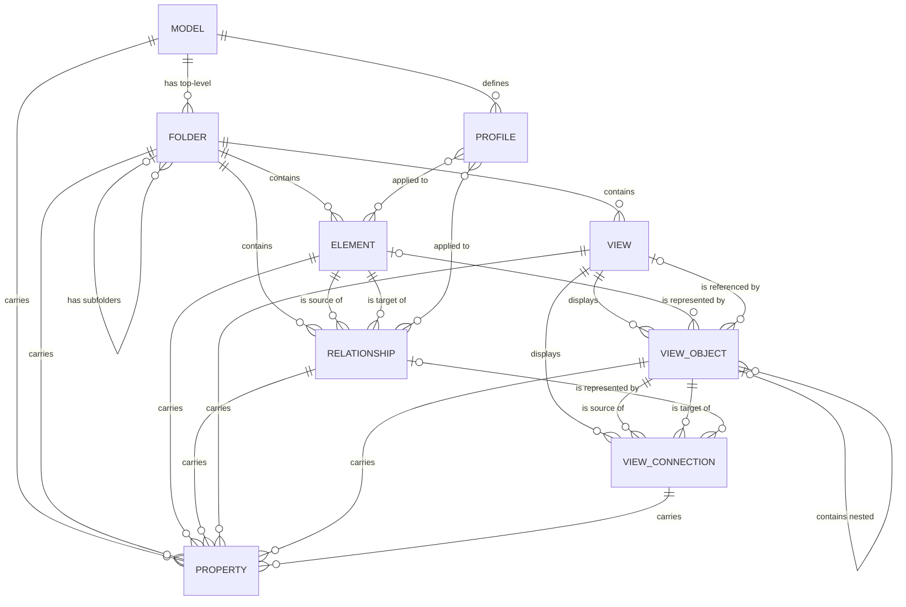

# Entity Model

## Entity Relationship Diagram

### MODEL

Represents a complete architecture model — the top-level container for all folders, elements, relationships, views, and profiles that make up one piece of modelling work.

| Attribute | Description                          | Data Type | Length/Precision | Validation Rules      |
|-----------|---------------------------------------|-----------|-------------------|------------------------|
| id        | Unique identifier                     | Long      | 19                | Primary Key, Sequence  |
| name      | Name of the model                     | String    | 255               | Not Null               |
| purpose   | Statement of the model's purpose      | String    | 2000              | Optional                |
| version   | Version label of the model            | String    | 20                | Optional                |

### FOLDER

Represents a named container used to organize elements, relationships, and views into a navigable hierarchy within a model.

| Attribute         | Description                                                                                                          | Data Type | Length/Precision | Validation Rules                                                                                |
|-------------------|------------------------------------------------------------------------------------------------------------------------|-----------|-------------------|----------------------------------------------------------------------------------------------------|
| id                | Unique identifier                                                                                                     | Long      | 19                | Primary Key, Sequence                                                                               |
| model_id          | Model the folder belongs to                                                                                           | Long      | 19                | Not Null, Foreign Key (MODEL.id)                                                                    |
| parent_folder_id  | Enclosing folder, when this folder is nested rather than top-level                                                     | Long      | 19                | Optional                                                                                             |
| name              | Name of the folder                                                                                                    | String    | 255               | Not Null                                                                                             |
| type              | Category of content the top-level folder was created to hold                                                          | String    | 30                | Not Null, Values: Strategy, Business, Application, Technology, Motivation, Implementation Migration, Other, Relations, Views, User |
| documentation     | Free-text notes about the folder's purpose                                                                             | String    | 2000              | Optional                                                                                             |

### ELEMENT

Represents a single ArchiMate concept placed in the model — such as a Business Actor, Application Component, or Technology Node — that is not itself a relationship.

| Attribute     | Description                                                                                                                  | Data Type | Length/Precision | Validation Rules                  |
|---------------|--------------------------------------------------------------------------------------------------------------------------------|-----------|-------------------|--------------------------------------|
| id            | Unique identifier                                                                                                             | Long      | 19                | Primary Key, Sequence                |
| folder_id     | Folder the element is organized under                                                                                         | Long      | 19                | Not Null, Foreign Key (FOLDER.id)     |
| name          | Name of the element                                                                                                           | String    | 255               | Not Null                             |
| type          | ArchiMate element type (e.g. Business Actor, Application Component, Technology Node, Goal, Requirement), drawn from the fixed set of types defined by the ArchiMate specification across the Strategy, Business, Application, Technology, Physical, Motivation, Implementation & Migration and Composite layers | String    | 50                | Not Null                             |
| documentation | Free-text description of the element                                                                                          | String    | 2000              | Optional                             |

### RELATIONSHIP

Represents a directed connection between two ArchiMate concepts that expresses how they relate, such as Composition, Assignment, or Serving.

| Attribute          | Description                                    | Data Type | Length/Precision | Validation Rules                                                                                        |
|--------------------|--------------------------------------------------|-----------|-------------------|-------------------------------------------------------------------------------------------------------------|
| id                 | Unique identifier                                | Long      | 19                | Primary Key, Sequence                                                                                        |
| folder_id          | Folder the relationship is organized under        | Long      | 19                | Not Null, Foreign Key (FOLDER.id)                                                                             |
| name               | Optional label for the relationship               | String    | 255               | Optional                                                                                                      |
| type               | Kind of relationship                              | String    | 20                | Not Null, Values: Composition, Aggregation, Assignment, Realization, Serving, Access, Influence, Triggering, Flow, Specialization, Association |
| source_element_id  | Concept the relationship originates from          | Long      | 19                | Not Null, Foreign Key (ELEMENT.id)                                                                            |
| target_element_id  | Concept the relationship points to                | Long      | 19                | Not Null, Foreign Key (ELEMENT.id)                                                                            |
| documentation      | Free-text description of the relationship         | String    | 2000              | Optional                                                                                                      |

**Note:** the ArchiMate specification also permits a relationship to connect to another relationship instead of an element in a small number of advanced cases (e.g. annotating a derived relationship). The common case modelled above — connecting two elements — covers the overwhelming majority of usage.

### VIEW

Represents a diagram, or a free-form canvas, that visually presents a chosen set of elements and relationships from the model.

| Attribute      | Description                                                                                     | Data Type | Length/Precision | Validation Rules                              |
|----------------|-----------------------------------------------------------------------------------------------------|-----------|-------------------|--------------------------------------------------|
| id             | Unique identifier                                                                                   | Long      | 19                | Primary Key, Sequence                             |
| folder_id      | Folder the view is organized under                                                                  | Long      | 19                | Not Null, Foreign Key (FOLDER.id)                  |
| name           | Name of the view                                                                                    | String    | 255               | Not Null                                          |
| type           | Kind of view                                                                                        | String    | 20                | Not Null, Values: ArchiMate Diagram, Sketch, Canvas |
| viewpoint      | Named viewpoint filter applied to an ArchiMate Diagram, restricting which element and relationship types are shown | String | 50 | Optional |
| documentation  | Free-text description of the view's purpose                                                         | String    | 2000              | Optional                                          |

### VIEW_OBJECT

Represents a visual shape placed on a view: a reference to a model element, a group, a note, an image, or a reference to another view.

| Attribute              | Description                                                                                       | Data Type | Length/Precision | Validation Rules                                              |
|------------------------|-------------------------------------------------------------------------------------------------------|-----------|-------------------|--------------------------------------------------------------------|
| id                     | Unique identifier                                                                                     | Long      | 19                | Primary Key, Sequence                                               |
| view_id                | View the shape appears on                                                                             | Long      | 19                | Not Null, Foreign Key (VIEW.id)                                     |
| parent_view_object_id  | Enclosing shape, when this shape is nested inside a group or container shape                          | Long      | 19                | Optional                                                            |
| element_id             | Model element this shape depicts, when it represents an element rather than free-form content         | Long      | 19                | Optional                                                            |
| referenced_view_id     | View this shape links to, when its type is View Reference                                             | Long      | 19                | Optional                                                            |
| type                   | Kind of shape                                                                                          | String    | 20                | Not Null, Values: Element Reference, Group, Note, Image, View Reference |
| x                      | Horizontal position on the view                                                                        | Integer   | 10                | Not Null                                                            |
| y                      | Vertical position on the view                                                                          | Integer   | 10                | Not Null                                                            |
| width                  | Width of the shape                                                                                     | Integer   | 10                | Not Null                                                            |
| height                 | Height of the shape                                                                                    | Integer   | 10                | Not Null                                                            |
| fill_color             | Background color of the shape                                                                          | String    | 20                | Optional                                                            |

### VIEW_CONNECTION

Represents a visual line on a view that connects two shapes, typically depicting a relationship between the elements those shapes represent.

| Attribute              | Description                                                                                    | Data Type | Length/Precision | Validation Rules                       |
|------------------------|-----------------------------------------------------------------------------------------------------|-----------|-------------------|---------------------------------------------|
| id                     | Unique identifier                                                                                    | Long      | 19                | Primary Key, Sequence                        |
| view_id                | View the connection appears on                                                                       | Long      | 19                | Not Null, Foreign Key (VIEW.id)               |
| source_view_object_id  | Shape the connection starts from                                                                      | Long      | 19                | Not Null, Foreign Key (VIEW_OBJECT.id)        |
| target_view_object_id  | Shape the connection points to                                                                        | Long      | 19                | Not Null, Foreign Key (VIEW_OBJECT.id)        |
| relationship_id        | Model relationship this connection depicts, when it represents a relationship rather than a free-standing link | Long | 19 | Optional |
| line_color             | Color of the connection line                                                                          | String    | 20                | Optional                                     |

### PROPERTY

Represents a custom name/value attribute that can be attached to a model, folder, element, relationship, view, or applicable view shape or connection to record additional information beyond the standard fields.

| Attribute | Description                        | Data Type | Length/Precision | Validation Rules |
|-----------|-------------------------------------|-----------|-------------------|-------------------|
| id        | Unique identifier                   | Long      | 19                | Primary Key, Sequence |
| key       | Name of the custom property         | String    | 100               | Not Null           |
| value     | Value of the custom property        | String    | 2000              | Optional            |

### PROFILE

Represents a user-defined specialization (stereotype) of a standard ArchiMate element or relationship type, used to tailor the notation with a custom name, icon, or meaning.

| Attribute          | Description                                                                                          | Data Type | Length/Precision | Validation Rules                  |
|--------------------|------------------------------------------------------------------------------------------------------|-----------|-------------------|--------------------------------------|
| id                 | Unique identifier                                                                                     | Long      | 19                | Primary Key, Sequence                 |
| model_id           | Model the profile is defined in                                                                       | Long      | 19                | Not Null, Foreign Key (MODEL.id)      |
| name               | Name of the profile                                                                                    | String    | 255               | Not Null                             |
| concept_type       | ArchiMate element or relationship type this profile specializes                                        | String    | 50                | Not Null                             |
| is_specialization  | Whether the profile behaves as a strict specialization (same semantics as the base type) rather than a free-form stereotype | Boolean | 1 | Not Null |
